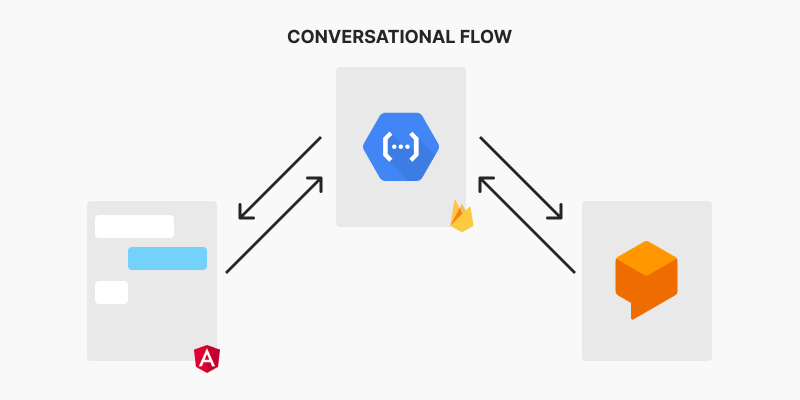
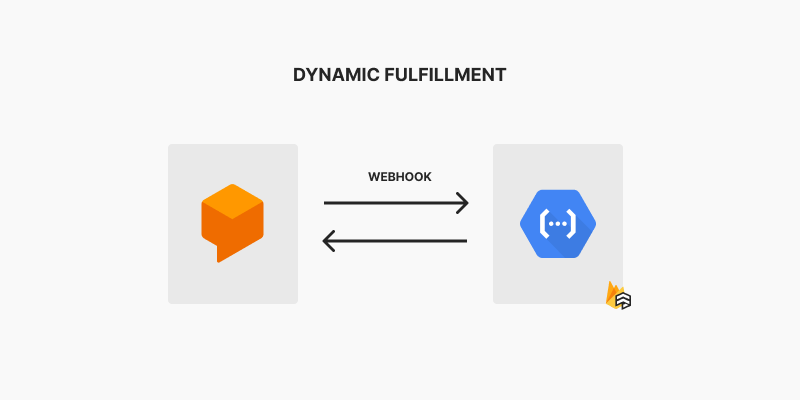

## Cloud Chatbot with Dialogflow

---

### Description
Powerful chatbot with async fulfillments made with Firebase Cloud Functions, Google Dialogflow and Angular 8. 🔥

### How it works
A user sends a message through frontend chatbot application, it makes an http call to a gateway cloud function that works as a proxy to make secure calls to dialogflow bot which processes the message based on context and provide a response sent back to the gateway that delivers it back to the user.



When the conversation gets to an end, the user's intention will be fulfilled. Here the dialogflow calls out an webhook, in this case, another cloud function, which dinamically processes the user's inputs (saves data on firestore) and finally responds with a map of fulfillments answers into the dialogflow intents, the bot now pick the proper answer based on the intent map and send the final message to the user.



### How to run it

#### Pre requisites

1. Create your application on firebase
2. Create your bot agent with intents on DialogFlow
3. Generate your service-account JSON file on your firebase console, then place it inside backend folder
4. Give your firebase application permissions on GCP IAM Dashboard to manipulate your DialogFlow bot

#### Backend

```bash
- cd backend
- nvm use 14
- npm i

### local firebase
- npm run serve
### production firebase deploy
- npm run deploy
```

#### Frontend
```bash
- cd chatbot
- npm i
- npm run start
```
